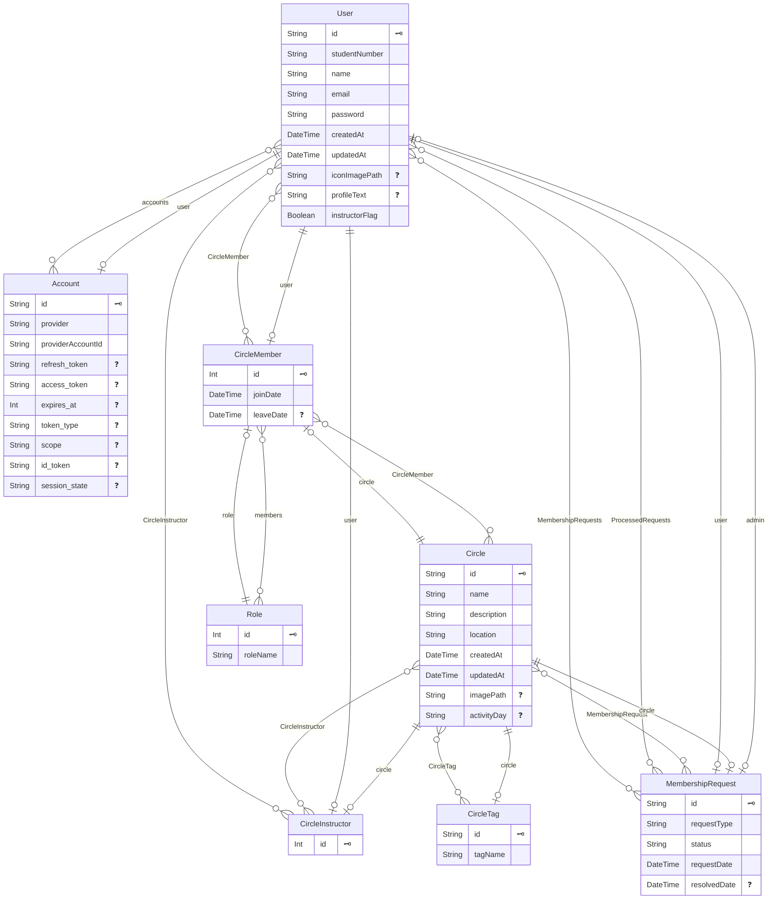

```mermaid
erDiagram

  "User" {
    String id "🗝️"
    String studentNumber
    String name
    String email
    String password
    DateTime createdAt
    DateTime updatedAt
    String iconImagePath "❓"
    String profileText "❓"
    Boolean instructorFlag
    }


  "Account" {
    String id "🗝️"
    String provider
    String providerAccountId
    String refresh_token "❓"
    String access_token "❓"
    Int expires_at "❓"
    String token_type "❓"
    String scope "❓"
    String id_token "❓"
    String session_state "❓"
    }


  "Circle" {
    String id "🗝️"
    String name
    String description
    String location
    DateTime createdAt
    DateTime updatedAt
    String imagePath "❓"
    String activityDay "❓"
    }


  "CircleMember" {
    Int id "🗝️"
    DateTime joinDate
    DateTime leaveDate "❓"
    }


  "MembershipRequest" {
    String id "🗝️"
    String requestType
    String status
    DateTime requestDate
    DateTime resolvedDate "❓"
    }


  "CircleInstructor" {
    Int id "🗝️"
    }


  "CircleTag" {
    String id "🗝️"
    String tagName
    }


  "Role" {
    Int id "🗝️"
    String roleName
    }

    "User" o{--}o "Account" : "accounts"
    "User" o{--}o "CircleMember" : "CircleMember"
    "User" o{--}o "CircleInstructor" : "CircleInstructor"
    "User" o{--}o "MembershipRequest" : "MembershipRequests"
    "User" o{--}o "MembershipRequest" : "ProcessedRequests"
    "Account" o|--|| "User" : "user"
    "Circle" o{--}o "CircleMember" : "CircleMember"
    "Circle" o{--}o "CircleInstructor" : "CircleInstructor"
    "Circle" o{--}o "CircleTag" : "CircleTag"
    "Circle" o{--}o "MembershipRequest" : "MembershipRequest"
    "CircleMember" o|--|| "User" : "user"
    "CircleMember" o|--|| "Circle" : "circle"
    "CircleMember" o|--|| "Role" : "role"
    "MembershipRequest" o|--|| "User" : "user"
    "MembershipRequest" o|--|| "Circle" : "circle"
    "MembershipRequest" o|--|o "User" : "admin"
    "CircleInstructor" o|--|| "User" : "user"
    "CircleInstructor" o|--|| "Circle" : "circle"
    "CircleTag" o|--|| "Circle" : "circle"
    "Role" o{--}o "CircleMember" : "members"
```
