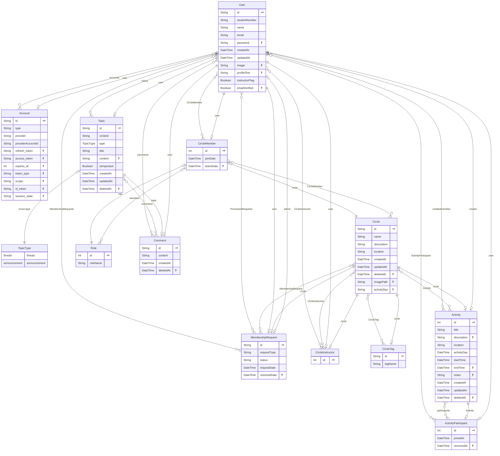

```mermaid
erDiagram

        TopicType {
            thread thread
announcement announcement
        }
    
  "User" {
    String id "🗝️"
    String studentNumber 
    String name 
    String email 
    String password "❓"
    DateTime createdAt 
    DateTime updatedAt 
    String image "❓"
    String profileText "❓"
    Boolean instructorFlag 
    Boolean emailVerified "❓"
    }
  

  "Account" {
    String id "🗝️"
    String type 
    String provider 
    String providerAccountId 
    String refresh_token "❓"
    String access_token "❓"
    Int expires_at "❓"
    String token_type "❓"
    String scope "❓"
    String id_token "❓"
    String session_state "❓"
    }
  

  "Circle" {
    String id "🗝️"
    String name 
    String description 
    String location 
    DateTime createdAt 
    DateTime updatedAt 
    DateTime deletedAt "❓"
    String imagePath "❓"
    String activityDay "❓"
    }
  

  "CircleMember" {
    Int id "🗝️"
    DateTime joinDate 
    DateTime leaveDate "❓"
    }
  

  "MembershipRequest" {
    String id "🗝️"
    String requestType 
    String status 
    DateTime requestDate 
    DateTime resolvedDate "❓"
    }
  

  "CircleInstructor" {
    Int id "🗝️"
    }
  

  "CircleTag" {
    String id "🗝️"
    String tagName 
    }
  

  "Role" {
    Int id "🗝️"
    String roleName 
    }
  

  "Activity" {
    Int id "🗝️"
    String title 
    String description "❓"
    String location 
    DateTime activityDay 
    DateTime startTime 
    DateTime endTime "❓"
    String notes "❓"
    DateTime createdAt 
    DateTime updatedAt 
    DateTime deletedAt "❓"
    }
  

  "ActivityParticipant" {
    Int id "🗝️"
    DateTime joinedAt 
    DateTime removedAt "❓"
    }
  

  "Topic" {
    String id "🗝️"
    String circleId 
    TopicType type 
    String title 
    String content "❓"
    Boolean isImportant 
    DateTime createdAt 
    DateTime updatedAt 
    DateTime deletedAt "❓"
    }
  

  "Comment" {
    String id "🗝️"
    String content 
    DateTime createdAt 
    DateTime deletedAt "❓"
    }
  
    "User" o{--}o "Account" : "accounts"
    "User" o{--}o "CircleMember" : "CircleMember"
    "User" o{--}o "CircleInstructor" : "CircleInstructor"
    "User" o{--}o "MembershipRequest" : "MembershipRequests"
    "User" o{--}o "MembershipRequest" : "ProcessedRequests"
    "User" o{--}o "Activity" : "createdActivities"
    "User" o{--}o "ActivityParticipant" : "ActivityParticipant"
    "User" o{--}o "Topic" : "topics"
    "User" o{--}o "Comment" : "comments"
    "Account" o|--|| "User" : "user"
    "Circle" o{--}o "CircleMember" : "CircleMember"
    "Circle" o{--}o "CircleInstructor" : "CircleInstructor"
    "Circle" o{--}o "CircleTag" : "CircleTag"
    "Circle" o{--}o "MembershipRequest" : "MembershipRequest"
    "Circle" o{--}o "Activity" : "Activity"
    "CircleMember" o|--|| "User" : "user"
    "CircleMember" o|--|| "Circle" : "circle"
    "CircleMember" o|--|| "Role" : "role"
    "MembershipRequest" o|--|| "User" : "user"
    "MembershipRequest" o|--|| "Circle" : "circle"
    "MembershipRequest" o|--|o "User" : "admin"
    "CircleInstructor" o|--|| "User" : "user"
    "CircleInstructor" o|--|| "Circle" : "circle"
    "CircleTag" o|--|| "Circle" : "circle"
    "Role" o{--}o "CircleMember" : "members"
    "Activity" o{--}o "ActivityParticipant" : "participants"
    "Activity" o|--|| "Circle" : "circle"
    "Activity" o|--|| "User" : "creator"
    "ActivityParticipant" o|--|| "Activity" : "Activity"
    "ActivityParticipant" o|--|| "User" : "user"
    "Topic" o|--|| "TopicType" : "enum:type"
    "Topic" o{--}o "Comment" : "comments"
    "Topic" o|--|| "User" : "user"
    "Comment" o|--|| "Topic" : "topic"
    "Comment" o|--|| "User" : "user"
```
